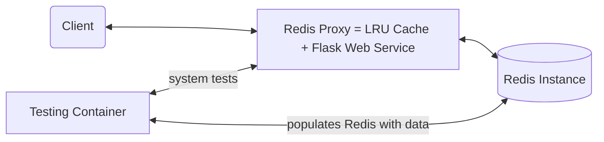

# Redis Proxy

*Transparent Redis HTTP proxy service*

# High-Level Architecture Overview

# Code Explanation
On startup, a docker-compose file builds and runs three separate containers: a single Redis instance, a web proxy consisting of the basic web service and the LRU cache, and a container for testing the Proxy.

## Redis Instance

The Redis instance is created by referencing the Redis image on Docker Hub. It is started with configurable environment variables for the port and the address.
## Web Proxy

The Web Proxy is found in the /app folder. It consists of a basic Flask web service that maps the HTTP GET request with the Redis "GET" command. The network of Redis is connected through Docker-Compose. The proxy first connects to the running Redis instance and then processes and stores the key in the user's GET request by using a LRUCache found in /app/localCache.py.

After connecting, when a user types a key in their web browser's address bar:
 - First, the program searches the local cache for the inputted key.
 - If the key is found in the cache, the key's TTL is checked.
	 - The key is deleted if it is past the global expiry time. The key is then placed back in the front of the cache with a reset time and priority.
- If the key is not found in the cache, the program searches the Redis instance for the key.
	- If present, the capacity of the cache is checked. If at capacity, the LRU key in the cache is deleted to make room for the new key.
	- The new key is then added to the front of the cache as the most recently used key.
	

## Algorithmic Complexity of Cache Operations

The LRU Cache is implemented by using a Python Dictionary, (called listMap), on top of a Doubly Linked List. The key in each key/value pair in the listMap holds the name of the key placed in the cache. The value is a pointer that points to the specific node in the doubly linked list that corresponds to that particular key. The doubly linked list consists of nodes that hold a key, a value, a timestamp when the node was created, and pointers to the prev and next nodes in the list. There are also stored references to the Head and Tail of the list. When a node is accessed, it is moved to the front of the list. This way, we can keep track of the least recently used key by deleting whatever node is at the Tail of the list when the cache is at capacity. 

The time complexity of the Cache's operations is as follows:

 1. **Searching for a key: O(1)**
	To search the cache, the dictionary is searched with the key as the parameter ("if key in  listMap ..."). If the return value is not None, then the key exists in the list and that key's value is returned by simply referencing the value in the dictionary entry that points to that key's node. Since a Python dictionary is able to search for a given key in constant time, and a pointer directly references the key's value, this operation is done in constant time.
2. **Updating a key's priority to be the Most Recently Used: O(1)**
	Whenever a key is accessed, its priority must be updated in the local cache. Since the key/value pair is stored as a node in a doubly linked list, this can be achieved by updating the node's prev and next pointers and using the stored reference of the list's Head to move the node to the front of the list. Since rearranging pointers is a fixed number of operations, this operation is done in constant time. This is the same process and time complexity if a new key is added to the cache.
3. **Deleting the Least Recently Used Node: O(1)**
	When the cache is at capacity, the LRU node must be deleted from the cache to make room for the new key. As mentioned previously, new nodes/newly accessed nodes are always added to the Head of the list, so the LRU nodes can be found at the end of the list. Since there is a reference to the Tail, the least recently used node can be quickly found and removed by updating its neighbor's prev and next pointers. This requires a fixed number of operations, so it is done in constant time. This is the same process and time complexity if a key that has expired must be deleted from the cache. 
4. **Checking if a key has expired: O(1)**
	When a key is added to the local cache, a timestamp is linked to that key which holds the time in seconds when that key was created. When a GET request is made for that key, the key's timestamp is checked against the current time (in seconds). If the node has existed longer than the set global expiry time, it is removed from the cache. The removal process is similar to deleting the least recently used node. Since the timestamp is simply an attribute of each node, accessing and comparing it to the current time takes constant time. 

## Concurrency

While Python automatically includes the Global Interpreter Lock (GIL) that only allows one thread to execute at a time, it is still essential to add locks as the GIL only protects the interpreter internally. To ensure no shared resources are accessed at the same time, locks are added when a user is attempting to read from the cache, move a key in the cache, and delete from the cache. 

Locks are not used when a user is reading from the Redis instance since this proxy only supports the GET function and therefore the keys in the Redis instance will remain the same. If I had more time, I would optimize the concurrency so that multiple clients could concurrently connect to the proxy. This would be done with multithreading to mimic sharing of the process resources.

# Running the Proxy 
	
To run the proxy, first make sure you have installed Docker and docker-compose as well as GNU Make. Next, clone this project's repo and enter into the top-level project directory on your local computer. To start the service, run *make test* on the CLI. This will build the three Docker images and then run the tests located in the testing container. If all of the tests pass, it will return a message with a link to the web proxy. At this point, you will be able to connect to the web server at the address and port specified..

To use the proxy, type in a forward slash into the URL followed by any key and the proxy will return the value if found. Creating new key/value pairs is not supported, but the Redis instance has been pre-populated with several key/values to simplify proxy use.
{
"name": "lilly",
"color": "blue",
"one": "two",
"a": "b",
"five": "six"
}

## System Tests
The system tests run at container startup. They are held in a separate container called "testing". The first test verifies that the Redis instance is valid by setting a value and getting it with the Redis get() and set() methods. The next tests verify that the cache and connection between the Proxy and Redis server are working by populating the Redis db and subsequently searching for keys in the cache. 

Although I wrote several tests, there are more tests I would have implemented if I had more time including testing concurrency, verifying the single backing Redis instance, and other small unit tests. 

## Configuration Values

The following config values are defined in an .env file and in the docker-compose file:
- REDIS_ADDRESS: (default = localhost)
- REDIS_PORT: (default = 6379)
- PROXY_PORT: (default = 5000)
- CACHE_EXPIRY_TIME: time in seconds that a key should exist in the local cache (default = 60)
- CACHE_CAPACITY: max number of keys allowed in the cache at any given time (default = 3)

## Missing Requirements
Due to time constraints, I was not able to implement the parallel concurrent processing, concurrent client limit, and Redis client protocol bonus requirements. 

## Time Taken to Complete Project

 - building the Flask web service – (0.5 hour)
 - setting up Docker containers and docker-compose – (2+ hours)
 - creating LRU cache and LRU eviction – (2 hours)
 - implementing global expiry to keys – (0.5 hour)
 - implementing locks for sequential concurrent processing - (0.5 hour)
 - system tests - (2+ hours)
 - README documentation - (1 hour)

*Notes:* The most time consuming part of this project for me was learning Docker and how the containers interact through docker-compose since I had not used Docker in depth before this. Because of this, I ran into some blocks along the way that slowed my progress particularly when trying to implement a testing container and running the tests inside the container. For this part of the project, I did research to reference examples of apps made through Docker and Docker-compose as well as examples of testing done through Docker containers. Although now I know how to do this efficiently, I ran out of time and did not implement as many tests as I would have liked to. I also wanted to make sure I completely understood every piece of my code and that it was the most optimal solution, so I spent time researching and learning new ways to implement certain concepts such as the LRU Cache and the locks for sequential processing - but I ultimately implemented the concepts through my own code and functions. 

